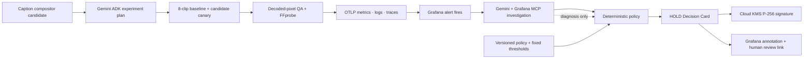

# Greenlight

> **Test the dependency update against what you actually ship.**

A dependency update can install cleanly, pass every unit test, and produce a technically valid MP4 while silently moving burned-in subtitles outside the delivery safe area. The file is valid. The frame is not—and the mistake may only surface when a client or platform rejects the campaign.

Friday, 9:12. Avery Morgan, a fictional Media Platform Lead at Loopline Studios, receives exactly that kind of green dependency PR while a campaign render queue is waiting. She needs one useful answer: **is this update safe to merge?**

Greenlight tests the update against Avery's actual media workflow before merge. A Gemini agent plans a locked media canary, Grafana raises and investigates the firing alert across metrics, logs, and traces, and pixel QA measures the caption actually rendered into each 9:16 frame. Five of eight updated masters fail by as much as 61 pixels, so the committed deterministic policy produces one auditable result: **HOLD**.

**Live Decision Card:** <https://greenlight-easase2aiq-ew.a.run.app>

The important boundary is deliberate: Gemini can choose experiments, correlate evidence, explain the failure, and annotate Grafana. It cannot change thresholds or promote the release. The evaluator accepts only the code-anchored policy hash, re-hashes raw MCP results before evaluation, and Cloud KMS signs the final Decision Receipt. The policy owns the verdict.

This repository contains a complete local vertical slice whose generated evidence is honestly labelled `local/synthetic`. It also contains a credential-free verification record for a real Vertex AI Gemini + Google ADK + Grafana Cloud MCP execution; that external execution does not turn synthetic canary data into production data.

For a media platform lead or pipeline engineer, the output is intentionally simple: keep the current dependency, repair the candidate, and replay the same locked canary before merging. Greenlight turns an ambiguous green PR into a reproducible delivery decision with the exact failing clip, pixel overflow, trace, policy, and signed receipt attached.

## One mission, eight receipted MCP calls



The live mission calls `alerting_manage_rules`, Prometheus twice, Loki, Tempo, `search_dashboards`, `create_annotation`, and `generate_deeplink`. Every call records its exact result hash. Query receipts can satisfy evidence requirements; workflow receipts prove the investigation closed the loop but have no decision authority.

## What the demo proves

`caption-compositor@0.1.0` lays captions out in the final 1080×1920 coordinate space and materializes a delivery-normalization pass after its portrait-caption raster. `caption-compositor@0.2.0-rc1` emits the delivery raster in one fused compositor pass but, for multiline captions, derives the block anchor in 1280×720 pre-transform coordinates and then applies the portrait Y scale. That real algorithmic defect pushes some caption pixels below the committed safe area.

The QA does not trust those declared coordinates. FFmpeg decodes a no-caption PNG and the captioned PNG to RGB, then Greenlight computes the changed-pixel bounding box. FFprobe independently checks each MP4's dimensions and duration. The vendored DejaVu Sans file, font configuration, FFmpeg binary, and FFprobe binary are fingerprinted into every receipt. The policy in [`policy/vertical-delivery-v1.yaml`](policy/vertical-delivery-v1.yaml) makes a failed 100% safe-area gate a deterministic `HOLD`.

```text
8 original synthetic 16:9 MP4s + locked cues/EditPlans
  → baseline + candidate 1080×1920 MP4s
  → decoded-pixel media QA + ffprobe validity
  → typed Change → EvidenceItems → validated Signal + resilience casefile
  → versioned Canary Pack + named invariants
  → committed deterministic policy
  → HOLD + immutable Decision Receipt + unobserved outcome fixture
```

## Requirements

- Node.js 22.18+ (tested with Node 24; native TypeScript stripping is used)
- FFmpeg and FFprobe with SVG, PNG, and H.264 support
- A modern browser

The optional live path additionally needs a billing-enabled Google Cloud project with Vertex AI credentials, a Grafana Cloud stack, and the OTLP endpoint/header values supplied by that stack.

The local slice has no database, auth layer, or external media downloads. A checked-in container definition includes Node 24 and FFmpeg for reproducible local or Cloud Run deployment.

## Run it

```bash
make install
make typecheck
make test
make canary
make build
make dev
```

Open `http://127.0.0.1:4173`. The canary writes its exact measurements under `artifacts/gl-local-*/` and refreshes `artifacts/latest/`. The runner emits real H.264 MP4s; it is not a still-only fallback.

To exercise the same build in a container:

```bash
docker build --build-arg GREENLIGHT_GIT_COMMIT="$(git rev-parse HEAD)" -t greenlight:local .
docker run --rm -p 8080:8080 greenlight:local
curl --fail http://127.0.0.1:8080/health
```

Once `gcloud` is authenticated to a billing-enabled project, the same Dockerfile can be deployed from the repository root with `gcloud run deploy greenlight --source . --region europe-west1 --allow-unauthenticated`. Cloud Run supplies `PORT`; the container listens on `0.0.0.0`.

Useful commands:

- `make canary`: regenerate originals, render both variants, run QA/policy, and write evidence.
- `make demo-fixture`: same deterministic local path, named for demo preparation.
- `make grafana-setup`: idempotently provision the versioned Grafana dashboard and safe-area alert through real MCP write calls.
- `make agent-live`: run the real Vertex AI Gemini planner, export the canary through OTLP, investigate the firing alert, correlate Prometheus/Loki/Tempo evidence, annotate the dashboard, and return its review link.
- `npm run live:sanitize`: derive the public, credential-free verification record from the successful raw capture.
- `npm run receipt:sign` / `npm run receipt:verify`: sign the bound receipt with Cloud KMS and verify it independently using the exported public key.
- `make typecheck`: compile-check the application, adapters, scripts, and tests without emitting files.
- `make test`: verify provenance/fingerprints, evidence eligibility and suppression, policy non-override, receipt sensitivity, HOLD/PROMOTE/REJECT semantics, MCP guardrails, the layout defect, and experiment selection.
- `make build`: copy the browser application to `dist/public`.
- `make clean-generated`: remove only this project's generated `artifacts/` and `assets/synthetic/generated/` trees.

The submission edit and its generated media are intentionally kept outside Git. The repository contains the application, deterministic canary, tests, versioned Grafana resources, and credential-free verification records; it does not use GitHub as storage for the final video master.

## Evidence layout

Each experiment contains:

- `media/<clip>/no-caption.png`, `baseline.{png,mp4}`, and `candidate.{png,mp4}`;
- per-variant QA JSON with both declared layout and measured pixel bounds;
- `metrics.json` and Prometheus exposition using the five `greenlight_*` metric names;
- `logs.jsonl` and `traces.json` with experiment, variant, clip, and compositor digest attributes;
- `evidence-bundle.json`, local and MCP-required policy evaluations, summary, ExperimentSpec, and Decision Card JSON.
- `change.json` and `evidence-casefile.json`, including the measured five-clip signal, evidence provenance, categorical support checks, applicability, reproduction, contradiction, and suppression state;
- `canary-pack.json` and `canary-run.json`, representing all eight clips and four named invariants with exact baseline/candidate gate measurements;
- `decision-receipt.json`, whose content fingerprint commits to the change, casefile/signal, Canary Pack and results, trusted policy hash, render toolchain, verdict, and reasons;
- `decision-outcome.fixture.json`, explicitly marked `local/synthetic`, `fixture/not-observed`, and `result: unknown`—it is a contract example, not a production observation.

The live supplemental card keeps query receipts (`metrics`, `logs`, `traces`) separate from workflow receipts (`alert`, `dashboard-search`, `annotation`, `navigation`). Workflow closure is auditable but never counts as policy evidence.

The eight source cases and asset rights are documented in [`dataset/vertical-social-v1.json`](dataset/vertical-social-v1.json) and [`assets/RIGHTS.md`](assets/RIGHTS.md). Verified source/original hashes are recorded in [`dataset/verified-hashes.json`](dataset/verified-hashes.json), while each run also writes `assets/synthetic/generated/inventory.json`.

## Evidence trust model

Local mode is for reproducible development and judging: complete local metrics/logs/traces plus a hashed local runner receipt may drive the visibly local Decision Card. It cannot be relabelled as MCP evidence.

The evidence model uses categorical `verified`, `contradicted`, and `missing` support checks. It deliberately emits no confidence percentage or success probability. Every run attaches the exact one-pass/two-pass path and p95 timing; because wall-clock timing is environment-dependent, a run that fails to reproduce the intended benefit is retained as a contradiction. That does not negate the directly reproduced pixel regression or change the blocking gate's `HOLD`. An authoritative flag means authoritative **within this repository-owned synthetic fixture**, never third-party truth.

Recommendation eligibility is conservative. Missing authority, contradictory evidence, an inapplicable component/version/code path, incomplete paired reproduction, or incomplete Canary Pack coverage suppresses promotion and produces `HOLD — INSUFFICIENT EVIDENCE` when the delivery gates otherwise pass. A failed blocking invariant also remains `HOLD`; an AI-style suggested action is not an input with decision authority.

Production/MCP-required mode is stricter. `provenance` must be `grafana-mcp`, and every receipt must be backed by its raw MCP result so Greenlight can recompute both the result hash and receipt ID before evaluation. The trace receipts must collectively carry a baseline/candidate pair. Missing or forged receipts force exactly `HOLD — INSUFFICIENT EVIDENCE`. See [`docs/integrations.md`](docs/integrations.md).

## Live Gemini/ADK + Grafana path

The repository bundles `@google/adk`, the MCP SDK peer required by ADK, a reachable `LlmAgent`/`Runner` runtime, `MCPToolset`, OAuth 2.1/PKCE, OTLP export, runtime tool discovery, and exact-call receipts. The complete orchestration entry point is `make agent-live`; it fails before making claims when configuration, a required tool category, or a receipt is missing.

Copy `.env.example` to an ignored `.env`, populate it from Google Cloud and the Grafana Cloud **OpenTelemetry → Send data** page, export those variables into the shell, then run:

```bash
set -a
source .env
set +a
make agent-live
```

The first run opens the hosted Grafana authorization page. OAuth tokens are kept outside the repository at `~/.config/greenlight/grafana-oauth.json` with mode `0600`; neither tokens nor OTLP headers are written into artifacts. Run `make grafana-setup` once before `make agent-live`; Grafana may request `grafana:write` consent for the dashboard, alert, and annotation tools. The raw capture remains ignored locally. The current sanitized run proves exact `v02` / `61 px` / Tempo trace correlation, four re-hashed evidence proofs, four workflow receipts, and the matching MCP-required `HOLD`: [`docs/verification/live-alert-dashboard-mcp-2026-09-03.json`](docs/verification/live-alert-dashboard-mcp-2026-09-03.json). Its Decision Receipt is signed by Cloud KMS in [`docs/verification/kms-decision-receipt-signature.json`](docs/verification/kms-decision-receipt-signature.json), with the public key in [`policy/trust/decision-receipt-public-key.pem`](policy/trust/decision-receipt-public-key.pem).

The complete Grafana resource and receipt boundaries are documented in [`docs/grafana-workflow.md`](docs/grafana-workflow.md). The agent can investigate and annotate the already-fixed verdict; only the deterministic evaluator can produce `PROMOTE`, `HOLD`, or `REJECT`.

No OpenAI or Anthropic model/API is invoked. `@modelcontextprotocol/sdk` is the transport peer used by Google ADK's official MCP integration; it is not used as an AI model or agent framework. Full boundaries and configuration gaps are in [`docs/integrations.md`](docs/integrations.md); verified versus unverified scope is in [`docs/implementation-status.md`](docs/implementation-status.md).

## Repository map

```text
dataset/       locked synthetic catalog, captions, manifest
policy/        immutable delivery gate
src/media.ts   original generation, both compositors, FFmpeg, pixel QA
src/evidence.ts typed provenance, resilience, Canary Pack, receipt/outcome builders
src/policy.ts  evidence validation and mechanical verdict
src/adapters/  Grafana MCP, OTLP, Gemini/ADK boundaries
src/web/       Decision Card application
test/          deterministic policy and planning tests
docs/          integration contract and implementation status
grafana/       versioned dashboard, alert rule, and provisioning boundaries
```

The domain contracts and fingerprint boundaries are documented in [`docs/evidence-model.md`](docs/evidence-model.md).

The live contest requirements and current pass/blocker matrix are tracked in [`docs/hackathon-compliance.md`](docs/hackathon-compliance.md).

## License

MIT. All decision-canary assets are original synthetic material generated by this repository. Submission-edit media is maintained separately and is not distributed in this repository.
